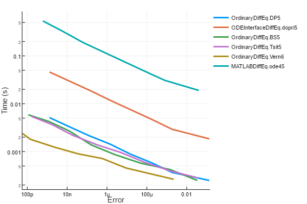

# MATLABDiffEq.jl

[](https://gitter.im/JuliaDiffEq/Lobby?utm_source=badge&utm_medium=badge&utm_campaign=pr-badge&utm_content=badge)

[](https://travis-ci.org/JuliaDiffEq/MATLABDiffEq.jl)

[](https://coveralls.io/github/JuliaDiffEq/MATLABDiffEq.jl)
[](http://codecov.io/github/ChrisRackauckas/MATLABDiffEq.jl?branch=master)

MATLABDiffEq.jl is a common interface binding for the [MATLAB](https://www.mathworks.com/products/matlab.html)

ordinary differential equation solvers. It uses the [MATLAB.jl](https://github.com/JuliaInterop/MATLAB.jl) interop in order to
send the differential equation over to MATLAB and solve it. Note that this
package requires the differential equation function to be defined using
[ParameterizedFunctions.jl](https://github.com/JuliaDiffEq/ParameterizedFunctions.jl).

Note that this package isn't for production use and is mostly just for benchmarking. For well-developed differential equation package, see
[DifferentialEquations.jl](https://github.com/JuliaDiffEq/DifferentialEquations.jl).

## Installation

To install MATLABDiffEq.jl, use the following:

```julia
Pkg.clone("https://github.com/JuliaDiffEq/MATLABDiffEq.jl")
```

## Using MATLABDiffEq.jl

MATLABDiffEq.jl is simply a solver on the DiffEq common interface, so for details see the [DifferentialEquations.jl documentation](https://juliadiffeq.github.io/DiffEqDocs.jl/latest/). However, there are two things to know:

1. The only options implemented are those for error calculations (`timeseries_error`), `saveat` and tolerances.
2. The input function must be defined by a `ParameterizedFunction`

Note that the algorithms are defined to have the same name as the MATLAB algorithms, but are not exported. Thus to use `ode45`, you would specify the algorithm as `MATLABDiffEq.ode45()`.

## Example

```julia
using DiffEqBase, MATLABDiffEq, ParameterizedFunctions


f = @ode_def LotkaVolterra begin
  dx = a*x - b*x*y
  dy = -c*y + d*x*y
end a=1.5 b=1 c=3 d=1

tspan = (0.0,10.0)
u0 = [1.0,1.0]
prob = ODEProblem(f,u0,tspan)
sol = solve(prob,MATLABDiffEq.ode45())
```

## Measuring Overhead

To measure the overhead of over the wrapper, note that the variables
from the session will be still stored in MATLAB after the computation
is done. Thus you can simply call the same ODE function and time it
directly. This is done by:

```julia
@time MATLABDiffEq.eval_string("[t,u] = $(algstr)(f,tspan,u0,options);")
```

To be even more pedantic, you can play around in the actual MATLAB
session by using

```
MATLABDiffEq.show_msession()
```

## Overhead Amount

Generally, for long enough problems the overhead is minimal. Example:

```julia
using DiffEqBase, ParameterizedFunctions, MATLABDiffEq
f = @ode_def_bare RigidBodyBench begin
  dy1  = I1*y2*y3
  dy2  = I2*y1*y3
  dy3  = I3*y1*y2 + 0.25*sin(t)^2
end I1=-2 I2=1.25 I3=-.5
prob = ODEProblem(f,[1.0;0.0;0.9],(0.0,100.0))
alg = MATLABDiffEq.ode45()
algstr = string(typeof(alg).name.name)
```

For this, we get the following:

```julia
julia> @time sol = solve(prob,alg);
  0.063918 seconds (38.84 k allocations: 1.556 MB)

julia> @time sol = solve(prob,alg);
  0.062600 seconds (38.84 k allocations: 1.556 MB)

julia> @time sol = solve(prob,alg);
  0.061438 seconds (38.84 k allocations: 1.556 MB)

julia> @time sol = solve(prob,alg);
  0.065460 seconds (38.84 k allocations: 1.556 MB)

julia> @time MATLABDiffEq.eval_string("[t,u] = $(algstr)(f,tspan,u0,options);")
  0.058249 seconds (11 allocations: 528 bytes)

julia> @time MATLABDiffEq.eval_string("[t,u] = $(algstr)(f,tspan,u0,options);")
  0.060367 seconds (11 allocations: 528 bytes)

julia> @time MATLABDiffEq.eval_string("[t,u] = $(algstr)(f,tspan,u0,options);")
  0.060171 seconds (11 allocations: 528 bytes)

julia> @time MATLABDiffEq.eval_string("[t,u] = $(algstr)(f,tspan,u0,options);")
  0.058928 seconds (11 allocations: 528 bytes)
```

## Benchmark

MATLABDiffEq.jl will be included into [DiffEqBenchmarks.jl](https://github.com/JuliaDiffEq/DiffEqBenchmarks.jl). However, the benchmarks are not encouraging to MATLAB at all.  Instead, they show that the cost of evaluating functions in MATLAB are too large (note that the functions are re-defined in MATLAB, meaning that they are true MATLAB functions and not interop functions).

Running benchmarks at various tolerance using the same Lotka-Volterra problem from before, we get the following:

```julia
using OrdinaryDiffEq, ODEInterfaceDiffEq, Plots, ODE
using DiffEqDevTools
abstols = 1./10.^(6:13)
reltols = 1./10.^(3:10)
sol = solve(prob,Vern7(),abstol=1/10^14,reltol=1/10^14)
test_sol = TestSolution(sol)
plotly()
setups = [Dict(:alg=>DP5())
          Dict(:alg=>dopri5())
          Dict(:alg=>BS5())
          Dict(:alg=>Tsit5())
          Dict(:alg=>Vern6())
          Dict(:alg=>Vern7())
          Dict(:alg=>MATLABDiffEq.ode45())
  ]
wp = ode_workprecision_set(prob,abstols,reltols,setups;appxsol=test_sol,dense=false,save_everystep=false,numruns=1000,maxiters=10000000,ttimeseries_errors=false,verbose=false)
plot(wp)
```



This shows that being able to run MATLAB ODE algorithms with MATLAB functions
is cute, but does not really have a practical use due to MATLAB's lack of
performance (and its [pass by copy](https://www.mathworks.com/matlabcentral/answers/152-can-matlab-pass-by-reference) for functions).
